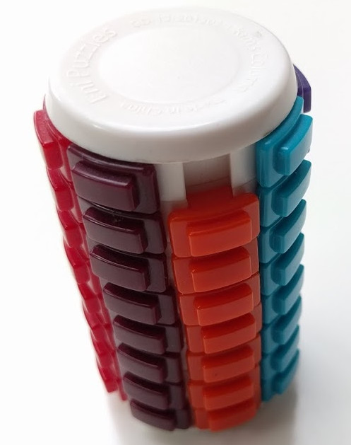
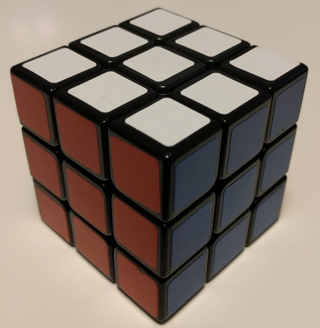

= Physical puzzles

Here there are some of my physical puzzles that I had fun solving them.

The list is (more or less) in chronological order, but at the moment without dates (I could add it in a future)

This kind was the first one (it was with a Sherlock Homes picture)...

image::./plain.jpg[plain, 400]

On next link there is a puzzle game.

http://jleahred.github.io/apps/puzzle3t/index.html[(jle puzzles)]

The first option is plain, second barrel and third (it's an original one) is a toroidal puzzle.

I wrote this game several years ago with Delphi language.

On the link, you can see a client web program written on Dart as a practice on this language and technology

image::./piramid.jpg[piramid, 400]
image::./supercubix.jpg[supercubix, 400]
image::./cluttered_supercubix.jpg[cluttered_supercubix, 400]
image::./wood.jpg[wood, 400]
image::./sphere.jpg[sphere, 400]
image::./2x2.jpg[2x2, 400]

It took long time till a got next puzzle.

image::./octogone.jpg[octogone, 400]

Cuttlered looks amazing

image::./cluttered_octagone.jpg[cluttered_octagone, 400]

I don't remember the name of next cube...

image::./weirdsquare.jpg[weirdsquare, 400]
image::./cluttered_weirdsquare2.jpg[cluttered_weirdsquare2, 400]
image::./cluttered_weirdsquare.jpg[cluttered_weirdsquare, 400]

Small but not easy

image::./3x2.jpg[3x2, 400]

This one require lot of concentration

image::./asymetric_3x3.jpg[asymetric_3x3, 400]
image::./cluttered_asymetric_3x3.jpg[cluttered_asymetric_3x3, 400]

A lot of pieces, and lot of them quite small\...

image::./dodecahedron.jpg[dodecahedron, 400]

