# Physical puzzles

Here there are some of my physical puzzles that I had fun solving them.

The list is (more or less) in chronological order, but at the moment without dates (I could add it in a future)

This kind was the first one (it was with a Sherlock Homes picture)...

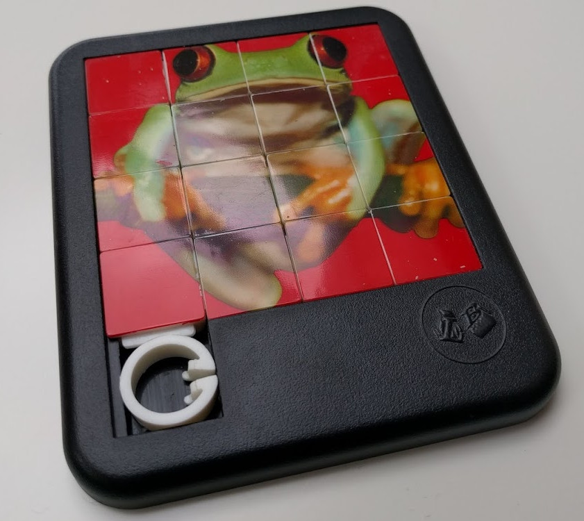

On next link there is a puzzle game.

[(jle puzzles)](http://jleahred.github.io/apps/puzzle3t/index.html)

The first option is plain, second barrel and third (it's an original one) is a toroidal puzzle.

I wrote this game several years ago with Delphi language.

On the link, you can see a client web program written on Dart as a practice on this language and technology

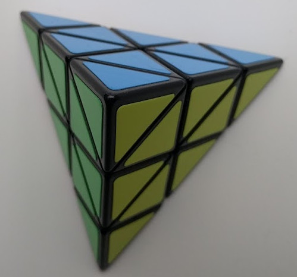

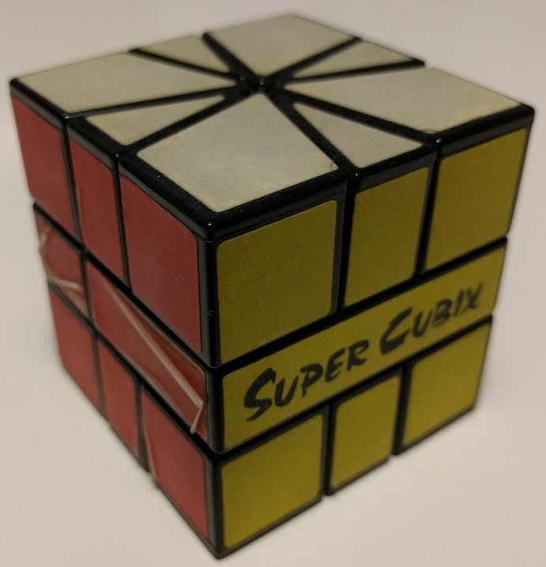

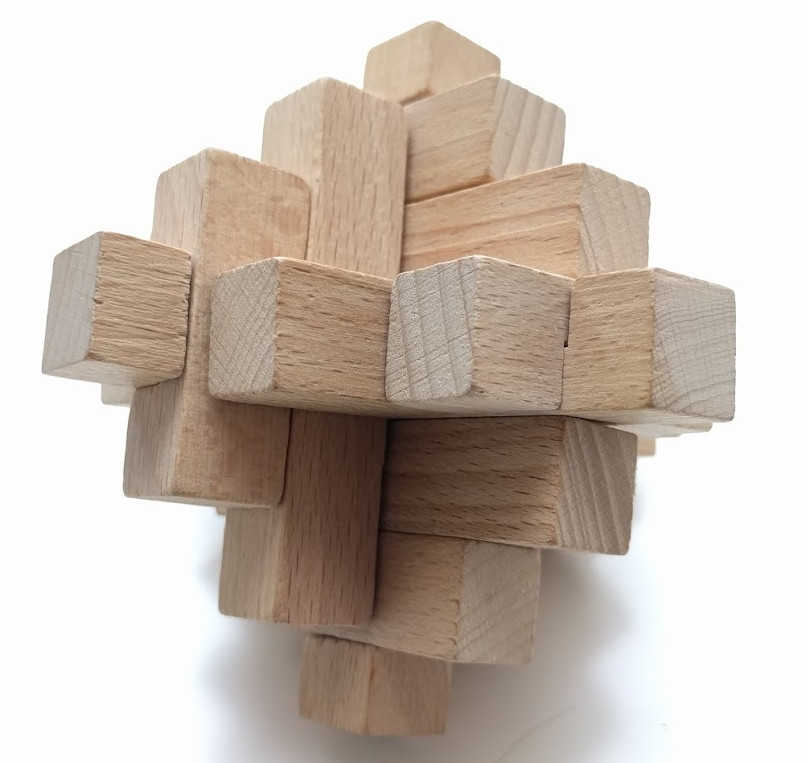

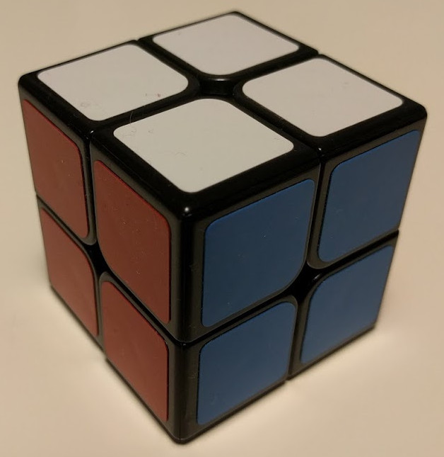

It took long time till a got this puzzle.

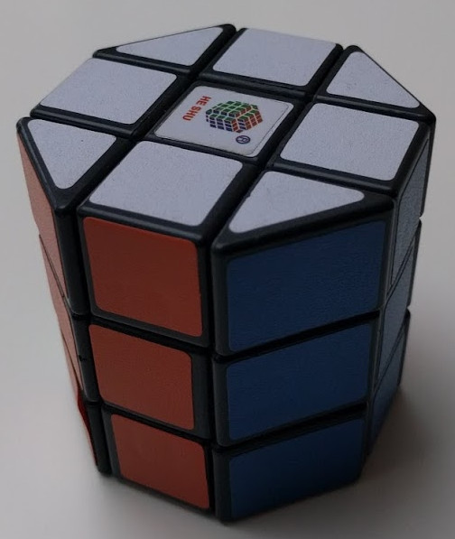

Cuttlered looks amazing

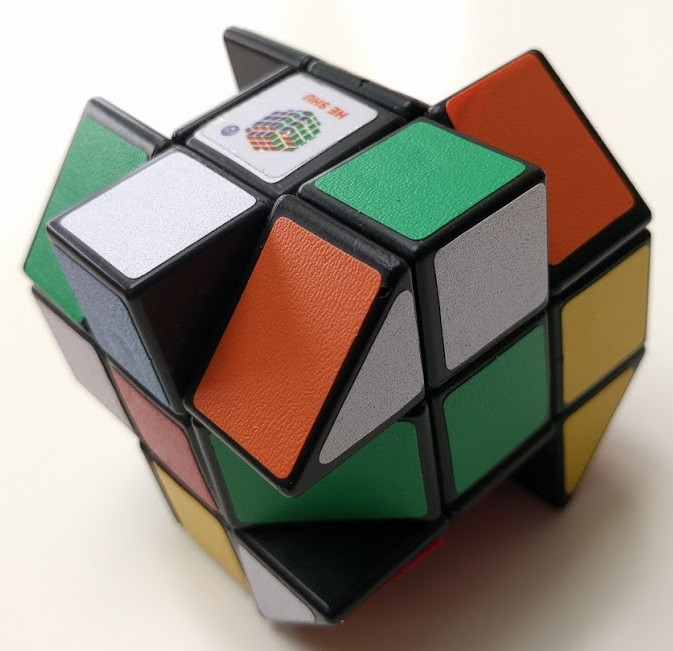

I don\'t remember the name of next cube\...

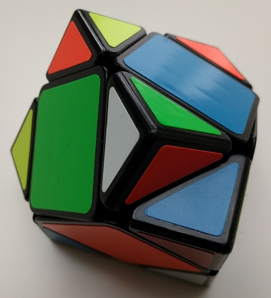

Small but not easy

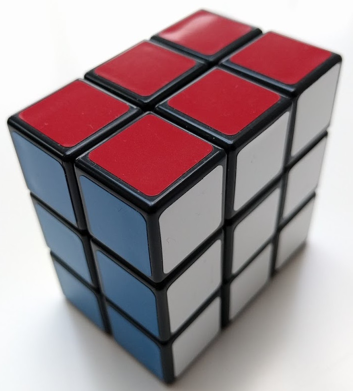

This one require lot of concentration

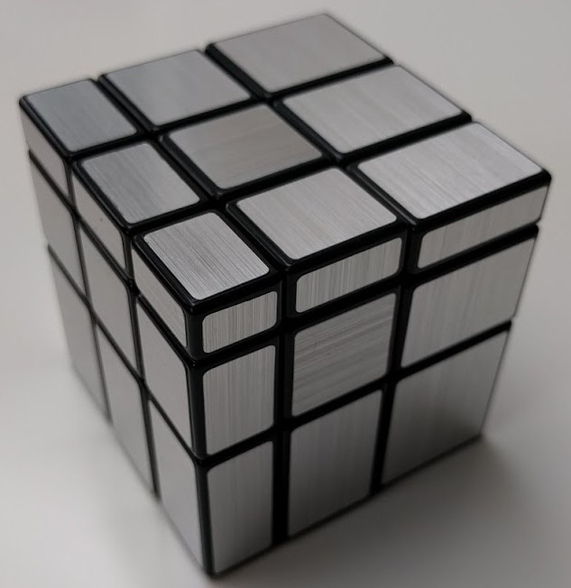

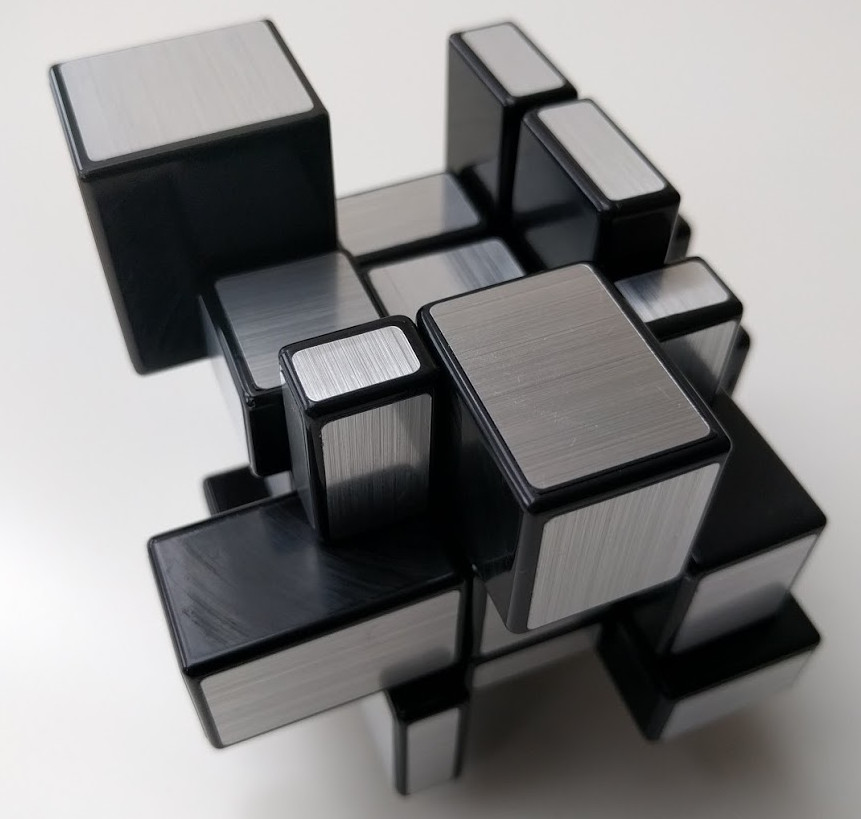

A lot of pieces, and lot of them quite small\...

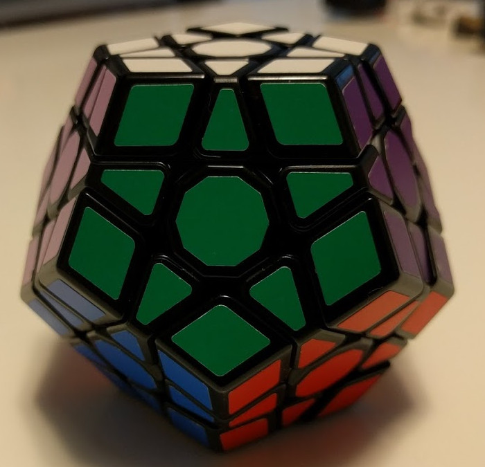
